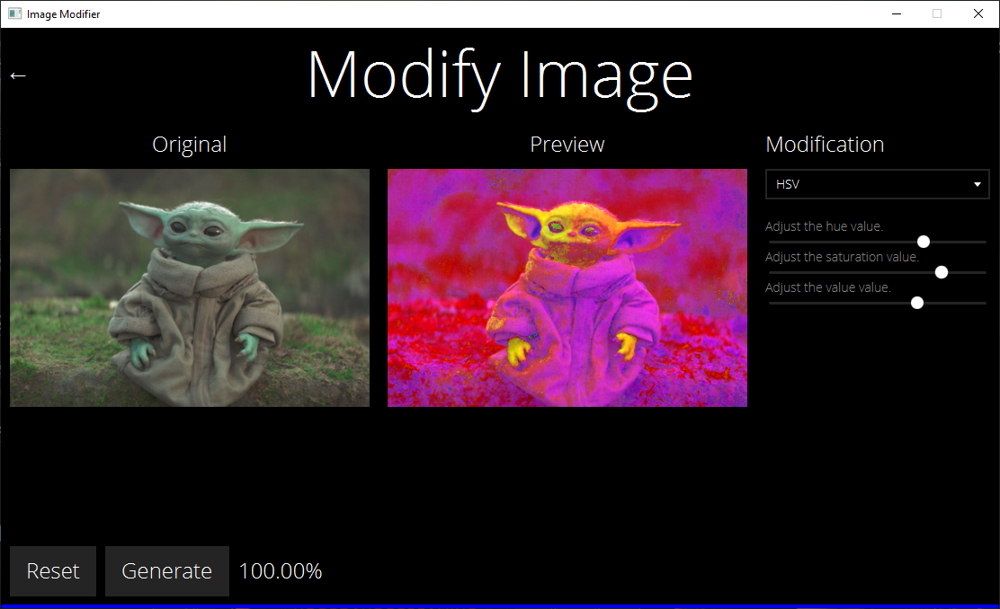
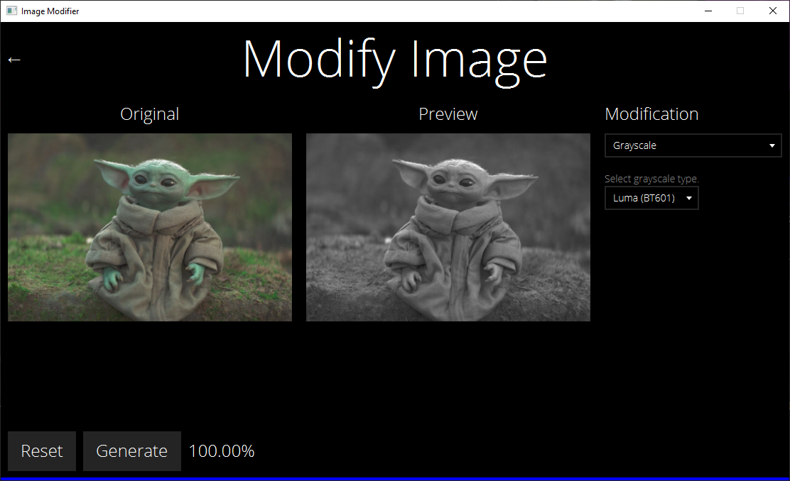

# Image Modifier
A JavaFX program that allows you to apply a series of modifications to an image and generate a new image.

## Installation
1. Download or clone the repository to your computer.
2. Run either `ImageModifier.jar` or `src/imagemodifier/Main.java`.
    - Java 15 may be required to run `ImageModifier.jar`.

### Setup
- Open **Settings** and ensure that the program is using the correct values.
    - The thread count defaults to the number of available processors on your computer (twice the number of cores your CPU has).
    - The thread timeout defaults to 30 seconds (30000 milliseconds)
- You can also change settings by modifying the values found in the `settings.cfg` file. This file is generated once you open the program for the first time.

## Usage
- Open **Modify Image** to start modifying your image.
- Click on the **Select Image** box to select an image.
    - If you would like to change the selected image, click on the original image.
- Select a modification using the drop-down list and adjust any settings associated with that modification.
    - A preview image will be generated after selecting a modification.
- Press the **Reset** button to remove all modifications that are applied to the image.
- Press the **Generate** button to save the modified image to your computer. The generated image will resemble the preview image, but will have a higher resolution as the preview image is downscaled to make the preview update faster.
    - There is a progress bar under the **Generate** button that displays the number of threads that have finished their tasks. As a result, if only 1 thread is used during generation, the progress bar will instantly jump from 0% to 100% once the image has been generated.
    - There is a label to the right of the **Generate** button that displays the progress in text form.

## Modifications
A list of modifications this program contains in the current version is shown below.

### Brightness, Contrast, and Gamma
This modification is used to control the brightness, contrast, and gamma values of the image.

#### Brightness and Contrast

- The brightness value is added to every pixel in the image, and defaults to 0.
    - The user can set the brightness value to be a value in `[-255, 255]` using the brightness slider.
- The contrast value is multiplied to every pixel in the image, and defaults to 1.
    - The user can set the contrast value to be a value in `[0, 5]` using the contrast slider.

The pixel value of an image after applying the brightness and contrast is determined with the following code.
```java
red = (int) (contrast * (red - 128) + 128 + brightness);
green = (int) (contrast * (green - 128) + 128 + brightness);
blue = (int) (contrast * (blue - 128) + 128 + brightness);
```

#### Gamma

- Each pixel in the image is raised to the power gamma. The gamma default value is 1.
    - The user can set the gamma value to be a value in `[0, 5]` using the gamma slider.

The pixel value of an image after applying the gamma is determined with the following code.
```java
red = (int) (Math.pow(red / 255.0, gamma) * 255.0);
green = (int) (Math.pow(green / 255.0, gamma) * 255.0);
blue = (int) (Math.pow(blue / 255.0, gamma) * 255.0);
```


### ARGB (Alpha, Red, Green, Blue)
This modification is used to control the alpha, red, green, and blue values of the image.


* The preview looks darker than the original because the alpha value was decreased, making the image more transparent. The body of the program is black, so the image appears to become darker whenever the opacity is decreased.

The pixel value of an image after applying this modification is determined with the following code.
```java
alpha += alphaDelta;
red += redDelta;
green += greenDelta;
blue += blueDelta;
```

### HSV (Hue, Saturation, Value)
This modification is used to control the hue, saturation, and value values of the image.



This modification first converts the RGB values to HSV.
```java
double max = Math.max(red, Math.max(green, blue));
double min = Math.min(red, Math.min(green, blue));
double range = max - min;

double hue = Double.NaN;

if(range == 0) {
    hue = 0;
} else if(max == red) {
    hue = ((green - blue) / range) % 6;
} else if(max == green) {
    hue = ((blue - red) / range) + 2;
} else if(max == blue) {
    hue = ((red - green) / range) + 4;
}

hue *= 60;

double saturation = max == 0 ? 0 : range / max;
double value = max;
```

Then the HSV values are modified with the following code.
```java
hue += hueDelta;
saturation += saturationDelta;
value += valueDelta;
```

Finally, the HSV values are converted back to RGB.
```java
double chroma = saturation * value;

hue /= 60;
double xComponent = chroma * (1 - Math.abs(hue % 2 - 1));

double redComponent = 0;
double greenComponent = 0;
double blueComponent = 0;

if(hue >= 0 && hue <= 1) {
    redComponent = chroma;
    greenComponent = xComponent;
} else if(hue > 1 && hue <= 2) {
    redComponent = xComponent;
    greenComponent = chroma;
} else if(hue > 2 && hue <= 3) {
    greenComponent = chroma;
    blueComponent = xComponent;
} else if(hue > 3 && hue <= 4) {
    greenComponent = xComponent;
    blueComponent = chroma;
} else if(hue > 4 && hue <= 5) {
    redComponent = xComponent;
    blueComponent = chroma;
} else if(hue > 5 && hue <= 6) {
    redComponent = chroma;
    blueComponent = xComponent;
}

double add = value - chroma;

red = redComponent + add;
green = greenComponent + add;
blue = blueComponent + add;
```

### YUV
This modification is used to control the Y', U, and V values of an image.


This modification first converts the RGB values to YUV.
```java
final double wr = 0.299;
final double wb = 0.114;
final double wg = 1 - wr - wb;
final double uMax = 0.436;
final double vMax = 0.615;

double yPrime = wr * red + wg * green + wb * blue;
double u = uMax * ((blue - yPrime) / (1 - wb));
double v = vMax * ((red - yPrime) / (1 - wr));
```
Then the YUV values are modified with the following code.
```java
yPrime += yDelta * 255;
u += uDelta * 255;
v += vDelta * 255;
```

Finally, the YUV values are converted back to RGB.
```java
red = (yPrime + v * ((1 - wr) / vMax));
green = (yPrime - u * ((wb * (1 - wb)) / (uMax * wg)) - v * ((wr * (1 - wr)) / (vMax * wg)));
blue = (yPrime + u * ((1 - wb) / uMax));
```

### Grayscale
This modification is used to apply a grayscale to the image. An algorithm chosen by the user is used to calculate the pixel intensity, then the red, green, and blue values are all replaced by that intensity. There are currently 10 different grayscale algorithm that you can select.



#### Luma (BT.601)
This grayscale algorithm attempts to preserve as much luminance from the original image as possible.

It uses the following algorithm to determine the pixel intensity.
```java
luminance = 0.299 * red + 0.587 * green + 0.114 * blue;
```

#### Luma (BT.709)
This grayscale algorithm attempts to preserve as much luminance from the original image as possible.

It uses the following algorithm to determine the pixel intensity.
```java
luminance = 0.2126 * red + 0.7152 * green + 0.0722 * blue;
```

#### Luma (BT.2000)
This grayscale algorithm attempts to preserve as much luminance from the original image as possible.

It uses the following algorithm to determine the pixel intensity.
```java
luminance = 0.2627 * red + 0.6780 * green + 0.0593 * blue;
```

#### Average
This grayscale algorithm gives red, green, and blue channels equal weight when determine the pixel intensity by averaging the 3 values.

It uses the following algorithm to determine the pixel intensity.
```java
luminance = (red + green + blue) / 3.0;
```

#### Red Channel
This grayscale algorithm only uses the red channel to determine the pixel intensity.

It uses the following algorithm to determine the pixel intensity.
```java
luminance = red;
```

#### Green Channel
This grayscale algorithm only uses the green channel to determine the pixel intensity.

It uses the following algorithm to determine the pixel intensity.
```java
luminance = green;
```

#### Blue Channel
This grayscale algorithm only uses the blue channel to determine the pixel intensity.

It uses the following algorithm to determine the pixel intensity.
```java
luminance = blue;
```

#### Desaturated
This grayscale algorithm desaturates the entire image. This is equivalent to using the HSV modifier and minimizing the saturation.

It uses the following algorithm to determine the pixel intensity.
```java
luminance = (Math.max(red, Math.max(green, blue)) + Math.min(red, Math.min(green, blue))) / 2.0;
```

#### Maximum
This grayscale algorithm only uses the maximum of the 3 channels to determine the pixel intensity.

It uses the following algorithm to determine the pixel intensity.
```java
luminance = Math.max(red, Math.max(green, blue));
```

#### Minimum
This grayscale algorithm only uses the minimum of the 3 channels to determine the pixel intensity.

It uses the following algorithm to determine the pixel intensity.
```java
luminance = Math.min(red, Math.min(green, blue));
```

### Threshold
This modification is used to binarize the image by setting all pixels with intensities higher than the specified threshold to black, and all pixels with intensities lower than the specified threshold to white. The BT.601 algorithm is used to determine the pixel intensity.


A pixel is modified with the following code.
```java
// calculate luminance (uses BT.601 to preserve luminosity)
double luminance = 0.299 * red + 0.587 * green + 0.114 * blue;

// check if luminance is above the threshold
if(luminance > threshold * 255) {
    // set color to black
    red = 0;
    green = 0;
    blue = 0;
} else {
    // set color to white
    red = 255;
    green = 255;
    blue = 255;
}
```

### Bit Depth
This modification is used to set how many bits each channel (including alpha) is able to use when generating colors.


Whenever the bit depth is set by the user, an array of possible values is generated for each channel.
```java
int totalValues = (int)Math.pow(2, bits);
values = new int[totalValues];

for(int i = 0; i < totalValues; i++) {
    values[i] = (i * 255 / (totalValues - 1));
}
```

There is also a method which takes an integer as input and outputs the closest value in the generated array to that integer.
```java
public int getClosest(int num) {
  int index = 0;
  int closest = num;
  
  for(int i = 0; i < values.length; i++) {
      int distance = Math.abs(num - values[i]);
  
      if(distance < closest) {
          index = i;
          closest = distance;
      }
  }
  
  return values[index];
}
```

Finally, the pixel value after the bit depth modification is set with the following code.
```java
alpha = getClosest(alpha);
red = getClosest(red);
green = getClosest(green);
blue = getClosest(blue);
```

### Kernel
This modification takes a matrix specified by the user and applies it to the entire image. This is achieved by getting the region around every individual pixel and multiplying that region with the matrix to calculate the final pixel value.


More information on this process can be found [here](https://en.wikipedia.org/wiki/Kernel_(image_processing)).

### Sobel
This modification applies a sobel to the entire image using kernels, which can be used for edge detection.


To get the overall magnitude for a particular pixel, the horizontal and vertical gradients are combined through the Pythagorean theorem.
```java
double gradientMagnitude = Math.sqrt(horizontalGradient * horizontalGradient + verticalGradient * verticalGradient);
```

The saturation of the pixel is maximized whereas the value of the pixel is determined by the gradient magnitude.
```java
double chroma = gradientMagnitude / 255;
```

If coloring the edges based on direction was selected, the hue of the pixel is set to the gradient direction. The gradient direction is found with the following code.
```java
double gradientDirection = -(Math.toDegrees(Math.atan2(horizontalGradient, verticalGradient)) - 180);
```

Otherwise, the color of the pixel is set to white.